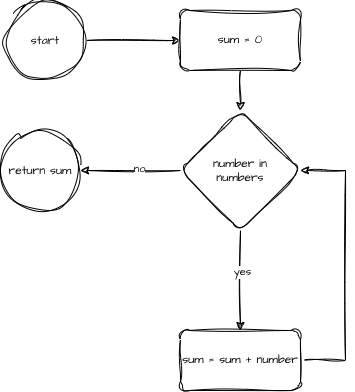

# Debugging Warm-Up 04

## Compiling and Testing

Generate the project build system (only needs to be one time for the project):

```
cmake -B build -S .
```

Build the project (done whenever there is a change to any of the files):

```
cmake --build build
```

Run the tests on the project:

```
ctest --test-dir build --output-on-failure
```

## Flow Chart



## Pseudocode

```
FUNCTION sum(numbers: ARRAY) RETURNS INTEGER
    DECLARE sum : INTEGER
    sum <- 0

    FOR i <- 0 to numbers.size()
        sum <- sum + numbers[i]
    NEXT i

    RETURN sum
ENDFUNCTION   
```
